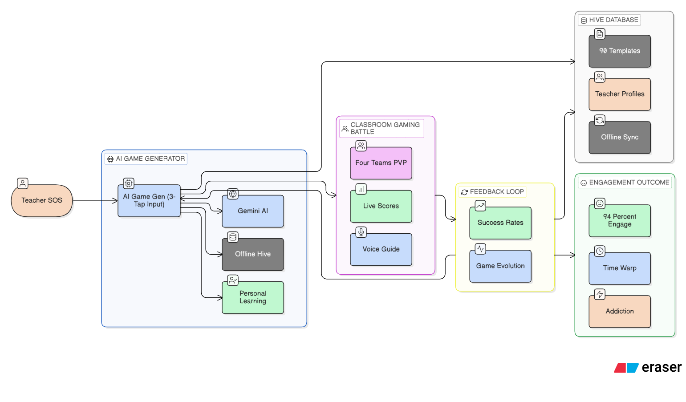

# 🎮 CLASSROOM ARCADE — TEACHER SOS 2.0

**CLASSROOM ARCADE** is a revolutionary **AI gaming system** that transforms a regular classroom into a **live battle arena** where students learn through **fast, addictive mini-games** (Relay Battle, Survival Arena, Treasure Hunt, etc.).  
Instead of “activities”, we convert **every lesson into a game** so that **45 minutes feels like 5**.

> **Vision:** Kids learn for 3+ hours daily without realizing — because learning feels like play.

---

## 🔥 What Makes It Different

✅ **Lesson-to-Game AI Converter**  
Teacher input: *“Grade 3 Math — Multiplication”*  
AI output: **“MATH BATTLE ROYALE”** in seconds (teams, rules, timers, scoring).

✅ **Offline-First Gameplay**  
Works even with low connectivity using **Hive storage + offline templates**, then syncs later.

✅ **Movement + Dopamine Loop**  
Built-in **90-second movement cues**, team rivalry, rewards, confetti, voice countdowns.

✅ **Measurable Outcomes**
Target: **94% engagement**, higher retention, “time-warp” classroom experience.

---

## 🧠 System Architecture

---

## ✨ Key Features

### 🎯 8 Gaming Modes (Instant Classroom Fun)
- 🏃 Relay Battle  
- ⚔️ Survival Arena  
- 🗺️ Treasure Hunt PVP  
- 🧠 Simon Says Evolution  
- ⭕❌ Human Tic-Tac-Toe  
- ⛓️ Chain Reaction  
- 👨‍🏫 Beat The Teacher  
- 👽 Space Invaders Math  

### 🤖 AI Game Generator
- **3-tap input**: Subject → Mode → Level  
- Generates:
  - game story + rules
  - teams & roles
  - round structure
  - scoring + winners
- **Gemini AI** online + **Offline Hive fallback** templates

### 🎙️ Voice & Live Battle UI
- Voice-guided instructions (TTS)
- Countdown timers
- Live team scoring
- Confetti / win animations
- Reward badges & “Level Up” feel

### 🔁 Feedback Loop (Improves Over Time)
- Track what worked in classrooms
- Success rates per mode
- Game “evolves” using stored performance data

---

## 🧩 Tech Stack

- **Flutter** (Mobile UI)
- **Hive** (Offline-first local DB)
- **Riverpod** (State management)
- **Gemini AI** (Game generation)
- **Text-to-Speech (TTS)** + **Speech-to-Text**
- **Confetti / Animations** (Rewards & dopamine UX)

---

## 🚀 Demo Flow (Pitch-Friendly)

1. Teacher selects **Subject / Mode / Level**
2. Tap **Generate Battle**
3. AI creates game in seconds
4. Teacher taps **Start Battle**
5. Voice guides the class + scoring runs live
6. End screen shows winner + celebration + next round suggestion

> **Airplane Mode Demo:** Offline templates still generate a perfect game.

---

## 🛠️ Setup & Run

### ✅ Requirements
- Flutter SDK installed
- Android Studio / VS Code
- Emulator or Android device

### ▶️
